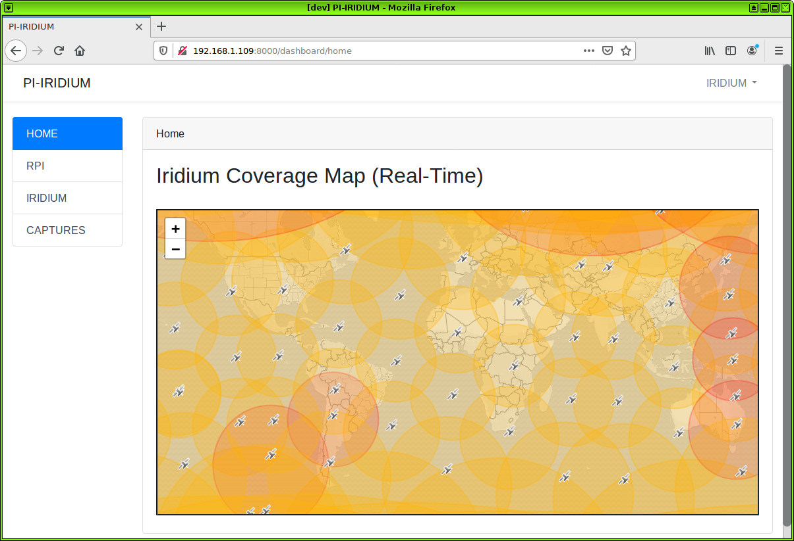

<p align="center"></p>

<p align="center">
<a href="https://travis-ci.org/laravel/framework"></a>
<a href="https://packagist.org/packages/laravel/framework"></a>
<a href="https://packagist.org/packages/laravel/framework"></a>
<a href="https://packagist.org/packages/laravel/framework"></a>
</p>

## pi-iridium



HI! :D

This is my (alpha) gr-iridium web controler for the RPI. This application was built to act as a web UI for the existing [gr-iridium](https://github.com/muccc/gr-iridium) binary and [iridium-toolkit](https://github.com/muccc/iridium-toolkit) scripts. 

Built with Laravel 7 for PHP 7.2.5+, this was a exercise for me to become more proficient with PHP/Laravel development and learn more about how PHP handles websockets and async jobs. In my expirence, creating this RPI app using Laravel wasn't the best use for this tech, Node.JS may be a better fit for any future progress with this web UI.

## Install
```
$ git clone https://github.com/notpike/pi-iridium
$ ./INIT.sh
```
After you run the INIT.sh script, update the .env file found in the root directory of pi-iridium with the gr-iridium and iridium-toolkit file paths. Be sure to use the full system path (ex. /home/user/gr-iridium) 

## Run
#### Local Server
```
$ ./START_LOCAL.sh
```

#### Remote Server
```
$ ./START.sh
```

#### Stop Service
```
$ ./STOP.sh
```

## Login
User: iridium
Pass: iridium

## Security
Below are known security issues for this alpha. No plans on correcting these for the alpha. Future versions of this will be done in Node.js. :)  

- DB creds are built from DB_INIT.sql (which is loaded by running INIT.sh) and creates user 'user' has a password of 'pass'. If you change this be sure the creds are reflected in the .env file.
- Websockets are PUBLIC
- Websockets API key pre-set in .env and bootstrap.js (Use node to reload)
- Downloads are NOT behind the web auth and can be downloaded without being loged in

## About Laravel

Laravel is a web application framework with expressive, elegant syntax. We believe development must be an enjoyable and creative experience to be truly fulfilling. Laravel takes the pain out of development by easing common tasks used in many web projects, such as:

- [Simple, fast routing engine](https://laravel.com/docs/routing).
- [Powerful dependency injection container](https://laravel.com/docs/container).
- Multiple back-ends for [session](https://laravel.com/docs/session) and [cache](https://laravel.com/docs/cache) storage.
- Expressive, intuitive [database ORM](https://laravel.com/docs/eloquent).
- Database agnostic [schema migrations](https://laravel.com/docs/migrations).
- [Robust background job processing](https://laravel.com/docs/queues).
- [Real-time event broadcasting](https://laravel.com/docs/broadcasting).

Laravel is accessible, powerful, and provides tools required for large, robust applications.


